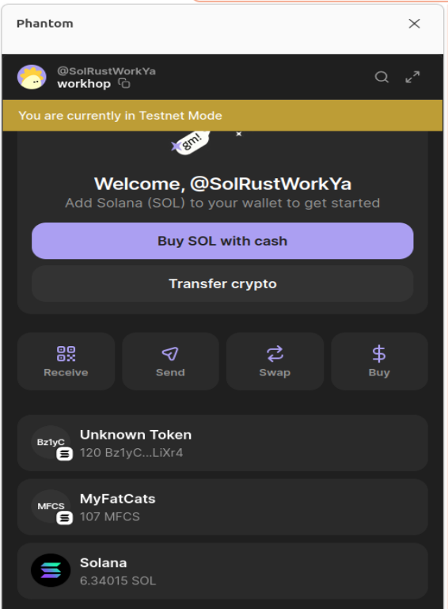
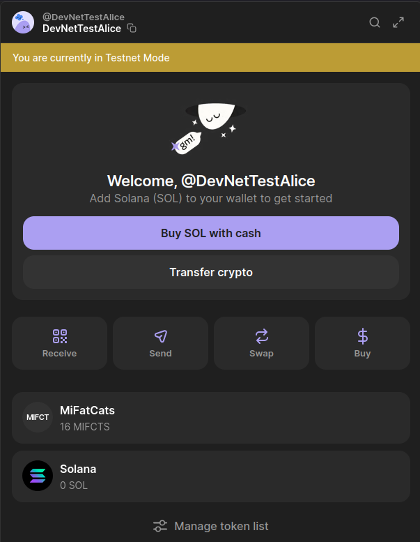

# 1. Учебный мини-лаунчпад на Solana + Anchor
Учебный мини-лаунчпад на Solana + Anchor: два on-chain контракта (SOL/USD oracle и token minter), Rust backend для обновления цены и прослушки событий, а также Remix фронтенд (папка `frontend/`).


# 2. Репозиторий
 - ## Исходный проект:

   https://github.com/EugenBA/mini-launchpad/tree/main
 - ## Измененный код:

   https://github.com/EugenBA/mini-launchpad/tree/dev

# 3. Изменения
## 3.1. Backend
- функция to_fixed_6
- тесты to_fixed_6_parses_integer_and_fractional_part, to_fixed_6_truncates_fraction_to_six_digits

## 3.2. Frontend
- mintinstruction.ts: изменена структура TransactionInstruction
## 3.3. Oracle
- функция: apply_price_update
- тесты: "initialize_oracle sets admin and defaults"

## 3.4. Minter
- функция: compute_fee_lamports, mint_token
- тесты: "initialize oracle + minter and mint token with fee"

## 3.5. Тесты
```text
make test
cd backend && cargo test --all && cd ../program && NODE_OPTIONS="--max-old-space-size=8192 --loader ts-node/esm --no-warnings" yarn run ts-mocha -p ./tsconfig.json -t 1000000 "tests/**/*.ts"
    Finished `test` profile [unoptimized + debuginfo] target(s) in 1.41s
     Running unittests src/main.rs (target/debug/deps/backend-d94a5e6f1fdf2b50)

running 7 tests
test tests::parse_token_created_returns_none_for_unrelated_logs ... ok
test tests::price_source_prefers_mock_over_url ... ok
test tests::price_source_uses_default_url_when_no_override ... ok
test tests::to_fixed_6_parses_integer_and_fractional_part ... ok
test tests::parse_token_created_reads_expected_fields ... ok
test tests::to_fixed_6_rejects_invalid_input ... ok
test tests::to_fixed_6_truncates_fraction_to_six_digits ... ok

test result: ok. 7 passed; 0 failed; 0 ignored; 0 measured; 0 filtered out; finished in 0.01s

yarn run v1.22.22
$ /home/eugen/mini-launchpad./program/node_modules/.bin/ts-mocha -p ./tsconfig.json -t 1000000 'tests/**/*.ts'


  token_minter (LiteSVM)
    ✔ initialize oracle + minter and mint token with fee (47ms)
    ✔ rejects mint when initial supply is zero
    ✔ rejects mint when decimals exceed allowed range

  sol_usd_oracle (LiteSVM)
    ✔ initialize_oracle sets admin and defaults
    ✔ update_price updates price only for admin
    ✔ rejects update_price from non-admin signer
    ✔ rejects zero price update


  7 passing (89ms)

Done in 3.26s.
```

## 3.6 Ссылки
- token
  https://explorer.solana.com/address/3hTZazYK7RcWvEY5gEKTega8purPv6gwH3ggihBrsZFf?cluster=devnet

- transaction mint token
  https://explorer.solana.com/tx/5HLupHE8NC8pe7jDru6B7w7XLDsixZzKhpP3qnxZMuzULgHgmNYAYbXfbfLp21pzFcJXHoR5W2FL4m9wMezGJN8D?cluster=devnet

- transaction transfer token
  https://explorer.solana.com/tx/3hz9SehyHyhRSqyL1ebx5dPcTWdggPJiuJ7nPFJPeWY8sdKCjyCnWJi7NKsEkL3h2i9r6XAP4sr811DXfMzGc6nY?cluster=devnet

# from:
 

# to:



- address miter
  https://explorer.solana.com/address/BvFGTCj3NFHrw54QMMHMnoxzvKXXUbgvEAR3LWj6jcuw?cluster=devnet

- address oracle
  https://explorer.solana.com/address/GyJHW5SbAXzUUPXNCUjgq9zJJnNqjj6kLECX1i3ynUWn?cluster=devnet

  
## Структура
- `program/` — Anchor workspace  
  - `programs/sol_usd_oracle` — хранит цену SOL/USD (decimals = 6)  
  - `programs/token_minter` — минтит SPL токены за комиссию в SOL, используя цену из oracle  
  - `tests/` — Anchor TS тесты  
- `backend/` — Rust сервис, который обновляет цену и слушает события `TokenCreated`
- `frontend/` — Remix hello-world (React Router)

## Быстрый старт (локально)

1. **Validator**: запустить `solana-test-validator` (или `make validator`). Для отображения имени, тикера и картинки токена в кошельке используйте валидатор с клоном Metaplex: `make validator-metaplex` (клон программы Token Metadata с mainnet). Убедитесь, что `~/.config/solana/id.json` есть и профинансирован (`solana airdrop 1000` при необходимости).

2. **Программы**: собрать и задеплоить (ID программ берутся из keypair в `program/target/deploy/`; при первом деплое выполните `anchor keys sync`, затем пересоберите):
   ```bash
   make build
   make deploy
   ```

3. **Инициализация**: один раз после деплоя инициализировать oracle и minter (скрипт выведет `ORACLE_STATE_PUBKEY` для `.env`):
   ```bash
   make init
   ```

## Деплой на Devnet

На фронте есть переключатель **Localnet / Devnet**. Для тестов на devnet:

1. Переключить CLI на devnet и пополнить кошелёк:
   ```bash
   solana config set --url devnet
   solana airdrop 2
   ```

2. Собрать и задеплоить на devnet:
   ```bash
   make deploy-devnet
   ```

3. Инициализировать оракул и минтер на devnet (один раз):
   ```bash
   make init-devnet
   ```

4. В приложении выбрать сеть **Devnet**, в кошельке переключиться на Devnet — можно минтить. На devnet Metaplex уже есть, картинка в кошельке может отображаться (если URI доступен по HTTPS).

4. **Backend**: скопировать `backend/.env.example` в `backend/.env`, подставить `ORACLE_STATE_PUBKEY` из вывода init-скрипта. Путь `BACKEND_KEYPAIR_PATH` поддерживает `~`:
   ```bash
   cd backend
   cargo run
   ```
   Сервис будет периодически вызывать `update_price` и слушать события `TokenCreated`, выводя их в stdout в JSON.

5. **Фронтенд** (опционально):
   ```bash
   cd frontend
   npm install && npm run dev
   ```
  Открыть http://localhost:7001.

6. **Тесты** (LiteSVM, без сети):
   ```bash
   cd program
   anchor test
   ```
   Или `yarn litesvm` для запуска только тестов в `tests/*.litesvm.ts`.

## Переменные окружения для backend

См. `backend/.env.example`. Основные:
- `SOLANA_RPC_HTTP`, `SOLANA_RPC_WS` — RPC локального валидатора или devnet/mainnet.
- `ORACLE_PROGRAM_ID`, `MINTER_PROGRAM_ID` — из `anchor keys list` (после деплоя).
- `ORACLE_STATE_PUBKEY` — PDA от seed `"oracle_state"`; выводится скриптом `program/scripts/init-local.js`.
- `BACKEND_KEYPAIR_PATH` — keypair администратора оракула (поддерживается `~`).
- Опционально: `MOCK_PRICE`, `PRICE_API_URL`, `PRICE_POLL_INTERVAL_SEC`.

## Метаданные токена (Metaplex)

При минте можно передать `name`, `symbol` и `uri` — контракт создаёт запись Metaplex Token Metadata (имя, тикер, картинка в кошельке). Если передать пустое имя, метаданные не создаются (подходит для localnet без Metaplex). Для отображения в кошельке поднимайте валидатор с клоном Metaplex: `make validator-metaplex`, затем деплой и `init` как обычно.

## Основные ограничения
- Все вычисления комиссии — integer math, `fee_lamports = mint_fee_usd * LAMPORTS_PER_SOL / price`.
- Oracle price и mint_fee_usd хранятся с точностью 10^6.
- Доступ к `update_price` только у oracle admin (backend keypair).
- `mint_token` падает, если `price == 0` или fee/supply некорректны.


---

## Порядок запуска (локально)

1. `solana-test-validator`
2. `cd program && anchor build && anchor deploy --provider.cluster localnet`
3. `cd program && node scripts/init-local.js` — скопировать `ORACLE_STATE_PUBKEY` в `backend/.env`
4. `cd backend && cargo run`
5. `cd frontend && npm run dev` — открыть в браузере и покликать.
